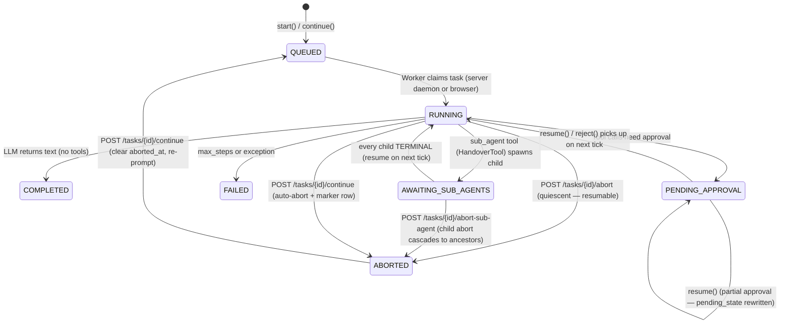

# Agent Loop: Async Architecture

## Overview

The Orchestrator loop is synchronous by design — no external queue daemon is required. Each `Orchestrator::start()` returns once the task is `QUEUED` (or, in legacy dev mode, `RUNNING`); a worker (server daemon or browser `SharedWorker`) calls `tick()` to drive the task to a terminal state. The deployment choice — server daemon, browser worker, with or without Mercure — lives in [Deployment modes](/reference/concepts/deployment-modes). The mechanics below (tick phases, task lifecycle, Mercure publishing) are identical across all three configurations.

The `WorkerMode` enum at `app/Agents/ValueObjects/WorkerMode.php` is single-case (`Worker`) — the legacy `WorkerMode::Sync` was removed when `SPORA_SYNC_MODE` was replaced. The new `WorkerRuntimeMode` enum (`server` / `client`) gates which CLI commands and HTTP routes are active; see [Environment variables → Worker runtime mode](/start/operators/env-vars#worker-runtime-mode) and [Client-worker mode](/deploy/shared-host/client-worker-mode).

## Tick Structure

`Orchestrator::tick()` runs in three phases to avoid holding a DB lock during the LLM round-trip:

**Phase 1 — Claim (short transaction with `lockForUpdate`)**

- Lock the task row
- Validate `status === 'RUNNING'`
- Abort early if `step_count >= max_steps` (marks task `FAILED` with `"Max steps reached."`)
- Commit → lock released

### Phase 2 — Load + LLM call (outside the transaction)

- Load agent, enabled tools, system prompt, and `LLMRequest` (no DB lock held)
- `Task::where('id', $taskId)->increment('step_count')`
- Blocking HTTP call to the configured LLM provider
- No DB connection held during the I/O round-trip

### Phase 3 — Write results

- If tool calls: `appendHistory`, execute tools, then either call `tick()` again or pause for approval (`PENDING_APPROVAL`)
- If text response: `appendHistory`, set `COMPLETED`

`safeExecute()` reads the calling agent's `user_id` from the row inside the Orchestrator and threads that into `execute()` — tools never see a session-derived user id, so async contexts (server-mode daemon, browser-driven `SharedWorker`, scheduled runs, sub-agent hops) all inherit the same trust boundary. See [Architecture → Orchestrator Loop](/reference/concepts/architecture#orchestrator-loop) for the invariant.

`resume()` (PR #173) takes a per-call `decisions` list and splits it via `AgentDecisionProcessor::splitDecisions()` into approved and rejected subsets inside a single `lockForUpdate()` transaction. Approved rows are handed to `ApprovedBatchExecutor` (PR #171 path — partial-approval semantics preserved: undecided rows stay `PENDING_APPROVAL`). Rejected rows are stamped `REJECTED` with `rejected_at` / `rejected_by` / `reject_reason` and a `role:'tool'` history row is appended carrying `toolCallId` + `toolName` so the LLM sees the rejection in its next round-trip. The task transitions back to `QUEUED` only when the batch leaves no `PENDING_APPROVAL` rows; partial-approval batches keep the task paused. `reject()` (task-level bulk) is unchanged in shape but does not write the per-call rejection columns. `ApprovedBatchExecutor` records worker-mode approvals with `executed_at IS NULL` as the "approved, awaiting execution" sentinel for the daemon's next drain (server mode) or the browser's next `/tick` (client mode).

**Partial approval.** When the LLM produced parallel tool calls and the operator approves only some of them, `resume()` does not transition the task out of `PENDING_APPROVAL` — it rewrites `pending_state` with the un-approved tool calls and returns, so the operator can keep deciding on later rounds. Un-approved `tool_calls` rows stay at `status='PENDING_APPROVAL'`; they are never silently executed with the LLM's original arguments, and never auto-rejected.

**Worker-mode tool pickup.** In Worker mode, `resume()` persists each approved tool as `status='APPROVED'` with `executed_at=NULL` (the worker-pickup sentinel) and returns without running the tool. When the daemon's `task:run` worker claims the resulting `QUEUED` task and runs `tick()`, `TickPhaseRunner::runTick()` calls `executeApprovedPendingToolsForTask()` first — it picks up those `APPROVED` + `executed_at IS NULL` rows, validates, executes, and appends the tool result to history — _before_ the LLM round-trip. The next assistant message therefore sees the tool results on the same round-trip. The HTTP `POST /api/v1/tasks/{id}/approve` response returns within ~100 ms regardless of how long the approved tool takes.

## Task Status Lifecycle



### Quiescent task states

`ABORTED`, `PENDING_APPROVAL`, and `AWAITING_SUB_AGENTS` together form the **quiescent** set: in every case the worker is not driving the task — the conversation is waiting on the operator (`PENDING_APPROVAL` tool call), on sub-agent children (`AWAITING_SUB_AGENTS`), or on the operator's next instruction after an explicit halt (`ABORTED`). The chat detail poller skips the entire set so the browser does not waste cycles fetching a task that is not making progress on its own. The poller re-arms the moment an action moves the task out — approve/reject from the approval bar, sub-agent child reaching a terminal state, or `POST /api/v1/tasks/{taskId}/continue` resuming an ABORTED task.

`AWAITING_SUB_AGENTS` is the suspended-while-sub-agent-children-run state set by the `HandoverTool` `sub_agent` op. Each spawn creates a regular `Task` with `parent_task_id` and bumps `data.sub_agent_expected_count` after the child tick. The first spawn also sets `data.sub_agent_batch_open` to `true` — a per-batch cross-process lock that prevents the per-child resume hook from racing the batch-boundary hook in worker mode. The resume gate compares the live child count from `data.spawned_sub_task_ids` against `sub_agent_expected_count` and only re-enters the loop when every sibling has reached a terminal state; the boundary hook then clears `sub_agent_batch_open` along with the other batch book-keeping. The next worker pickup (server daemon's `task:run` or browser's `/tick`) drains it via `TickPhaseRunner::maybeResumeParentFromBatchBoundary`. See [Tool system → Handover](/reference/concepts/tools#handover-tool) for the LLM-facing contract.

## Worker CLI

Server mode only. The CLI commands below are the operator's tools for `worker_runtime_mode: server`. In `client` mode the same commands exit with a docs-link error — see [Client-worker mode](/deploy/shared-host/client-worker-mode) for the browser-driven equivalent.

**Entry point:** `bin/spora` (via `WorkerRunCommand`)

```bash
# Default: persistent daemon — continuously polls for scheduled runs and QUEUED tasks
php bin/spora worker:run

# One-shot scheduled runs only, then exit
php bin/spora worker:run --once

# One-shot: scheduled runs + QUEUED tasks, then exit
php bin/spora worker:run --once --include-queue

# Orphan reaper: mark stale RUNNING tasks as FAILED, then exit
php bin/spora worker:run --reap-only

# Options
--limit=N         Max QUEUED tasks per poll cycle (0 = unlimited, default: 0)
--sleep=N         Microseconds to sleep when queue is empty (default: 500000)
--stale-minutes=N Minutes before a RUNNING or AWAITING_SUB_AGENTS task is considered orphaned (0 = disabled; omit to use config default of 60)
--workers=N       Max concurrent child processes (0 = unlimited)
--once            Process due scheduled runs then exit (one-shot)
--include-queue   With --once: also drain the QUEUED task queue
--reap-only       Reap orphaned RUNNING tasks once, then exit
--daemon          Explicit daemon mode (default when no flag is given)
```

### Deployment modes

| Command                             | Scheduled runs | QUEUED tasks | Exit                  | Typical use                           |
| ----------------------------------- | -------------- | ------------ | --------------------- | ------------------------------------- |
| `worker:run`                        | ✓              | ✓            | Never (until SIGTERM) | VPS/Docker always-on (default daemon) |
| `worker:run --reap-only`            | —              | —            | After one iteration   | Maintenance: orphan reaping only      |
| `worker:run --once`                 | ✓              | —            | After processing      | Cron for scheduled runs               |
| `worker:run --once --include-queue` | ✓              | ✓            | After processing      | Full cron replacement                 |

For the **client-mode** equivalent (browser-driven, no daemon), see [Client-worker mode](/deploy/shared-host/client-worker-mode) and the [Deployment modes](/reference/concepts/deployment-modes) overview.

**Cron setup:**

```cron
# Full queue drain every minute
* * * * * /usr/bin/php /path/to/spora/bin/spora worker:run --once --include-queue >> /path/to/spora/storage/worker.log 2>&1
```

The daemon (`--daemon`) uses the same `storage/spora-worker.lock` as the one-shot modes, preventing concurrent workers. After each scheduled run, `next_run_at` is computed using wall-clock `now` (in the schedule's timezone) as the cron reference — not the actual last run time — so arbitrarily-delayed cron invocations are handled correctly without drift.

For the full deployment reference (Docker, systemd, supervisord, reaping, single-instance enforcement, monitoring), see the [Worker deployment](/reference/concepts/worker-deployment) page.

## Mercure SSE (Optional — Docker / FrankenPHP)

When `SPORA_MERCURE_URL` and `SPORA_MERCURE_JWT_KEY` are set, the `Orchestrator` publishes task state changes to a Mercure hub after each `tick()` step (intermediate tool results and `PENDING_APPROVAL` pauses) and on worker claim / scheduled run dispatch. The frontend subscribes to principal-scoped task topics — one `principal/{principalId}/tasks` topic per principal the caller can act as (their user-principal plus the group-principals of every group they belong to) — plus the user-scoped `user/{userId}/notifications` topic for user notifications, for real-time updates instead of polling. The principal-keyed task topic is what lets every group peer with read rights receive the same live task events as the trigger user; the notification topic stays user-keyed because the notifications table is per-user.

When the env vars are not set, `MercurePublisher::publish()` early-returns `false` (logged at debug level) — polling remains the default for all deployments.

**Env vars (FrankenPHP native Mercure — no separate service needed):**

```text
SPORA_MERCURE_URL=https://spora.example.com/.well-known/mercure
SPORA_MERCURE_JWT_KEY=your-shared-secret
```

> **Don't use `http://localhost/...` (no port) in Docker when `SERVER_NAME` is a public domain.** Caddy's auto-HTTPS layer redirects every plain-HTTP request — including the in-cluster publish POST — to `https://...`, and the publisher fails with `tlsv1 alert internal error`. Use `SPORA_MERCURE_PUBLISH_URL=http://localhost:80/.well-known/mercure` (loopback with explicit port — the bundled `docker/frankenphp.conf` adds `http://localhost:80` as a second site address so the host matches). Avoid `http://spora:80/...` (bakes the docker-compose service name into the image) and `http://localhost/...` (no port).

A separate `SPORA_MERCURE_PUBLISH_URL` may be set if the publisher posts to a different endpoint than the public hub URL the browser subscribes to (e.g. behind a reverse proxy that disallows loopback).

FrankenPHP bundles a Mercure hub natively — no separate service needed in that configuration.

### Subscribing from the browser — the `__Secure-mercure_access_token` flow

The Mercure hub is **not** anonymous — every update carries a principal-scoped task topic (`principal/{principalId}/tasks`) or a user-scoped notification topic (`user/{userId}/notifications`) and Mercure rejects subscribers whose JWT does not scope to those topics. The browser obtains its JWT through a short exchange with the app rather than embedding a long-lived secret in JS:

1. The Vue app calls `GET /api/v1/sse/authorize` (session-cookie authenticated).
2. The endpoint returns a short-lived subscriber JWT scoped to the calling user's topics, and the framework sets it as a `__Secure-mercure_access_token` HttpOnly cookie.
3. The frontend opens an `EventSource` against `SPORA_MERCURE_URL` with `credentials: 'include'`. The browser attaches the cookie to the hub handshake and Mercure accepts the subscription.
4. The frontend re-runs step 1 periodically to refresh the cookie before expiry; the `EventSource` reconnect path picks up the new value transparently.

Because the cookie name is `__Secure-`, browsers only send it over HTTPS — `SPORA_APP_URL` and `SPORA_MERCURE_URL` must use `https://` in production.

## Environment Variables

See [Environment variables](/start/operators/env-vars) for the consolidated reference (worker modes, Mercure, logging, database, etc.).
