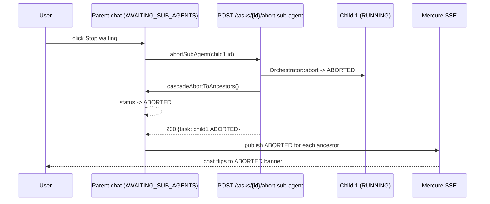

# First conversation

This walks through a first session with Spora: signing in, sending a message, reading the reply, and understanding what just happened.

## Step 1 — Sign in

Open `http://localhost:8080` (or your deployment URL) in a browser. You'll see the login screen.

The default seeded admin credentials are printed by `db:seed` — `admin@spora.local` / `password` (defined in `spora-core/app/Core/DatabaseSeeder.php:47`). **Change these immediately** under **Settings → Users → Edit**.

If you disabled `SPORA_ALLOW_REGISTRATION` before creating your account, you can't sign up via the UI. Ask an admin to create the account for you, or re-enable registration in `.env` and restart.

## Step 2 — Pick an agent (or create one)

After sign-in, the home page lists your agents. By default there's a single sample agent (created by `db:seed` if you ran it). Click on it to open the chat.

If no agents exist, go to **Agents → New** and create one. The minimum:

- **Name** — what the agent is (e.g. "Research Assistant")
- **System prompt** — instructions for the LLM (e.g. "You are a helpful research assistant. Be concise. Cite sources.")
- **LLM config** — which model to use. The seeded agent points at a placeholder LLM; you need to configure one. See [Managing agents → LLM config](/start/end-users/managing-agents#llm-config).
- **Tools** — leave empty for now. The agent will reply without using any tools.

## Step 3 — Send a message

In the chat input at the bottom of the page, type something like:

> What's the capital of France?

Press Enter (or click Send). The page shows:

1. **Your message** in a bubble
2. **The agent's reply** appearing once the LLM responds
3. **Optional: a tool-call timeline** — if the agent called any tools, you see them with their inputs and outputs

For a simple "what's the capital" question with no tools enabled, the agent replies directly without calling anything. The reply is the LLM's plain text output.

## Step 4 — Read the agent's reply

The reply bubble shows:

- **The text** the agent produced
- **The model** that answered (if you have multiple LLM configs, hover or click to see which was used)
- **Token usage** — usually visible at the bottom of the bubble (input tokens, output tokens, cached)

If the LLM config has `exposeToLlm: true` settings (e.g. allowed domains for a search tool), the LLM sees those values as part of its system prompt. The reply is grounded in those values.

## Step 5 — Try with a tool

To see the agent call a tool:

1. Install a plugin. Go to **Plugins → Browse** (if enabled) or run `php bin/spora plugin:install spora-ai/spora-plugin-tavily` on the server.
2. Configure the tool. Go to **Tools → Tavily Search** and paste your `api_key` (from <https://tavily.com>).
3. Open your agent, go to the **Tools** tab, and enable Tavily Search.
4. Send a message: "Search the web for the latest on Apple's Vision Pro"

The agent will:

1. Recognise that the query needs web search
2. Call the `tavily_search` tool with your query
3. Receive the search results
4. Compose a reply that cites the sources

You'll see the tool call in the chat timeline — the agent's "thinking", the tool call with its arguments, the tool's result, and the agent's final reply.

## What just happened

Every chat message is a **task** in the Orchestrator. The lifecycle:

1. **Claim** — your message creates a `Task` record in `QUEUED` state. A worker (server daemon or browser `SharedWorker`) drives it.
2. **LLM call** — Orchestrator calls the LLM with the system prompt + your message + tool definitions
3. **Branch** — if the LLM returns text, the task is `COMPLETED`; if it returns a tool call, the Orchestrator executes the tool and calls the LLM again with the result
4. **Loop** — repeat step 3 until the LLM returns text or `max_steps` is reached
5. **History** — every LLM message and tool call is appended to `task_history` for the next turn

For details, see [Concepts → Agent loop and async mode](/reference/concepts/agent-loop-async).

## What the chat timeline shows

- **Your message** (right-aligned, plain text)
- **The agent's "thinking"** — appears when the assistant message contains `content_blocks` entries of type `thinking` (Anthropic with thinking enabled) or `redacted_thinking`. Token counts are surfaced separately in the `usage` panel (`input_tokens`, `output_tokens`, `cache_creation_tokens`, `cache_read_tokens`, …).
- **Tool calls** — the LLM's `tool_use` block, shown with the tool name, arguments, and the result
- **The final reply** (left-aligned, the agent's actual response)
- **Aborted at HH:MM** — a faint horizontal divider the chat inserts after the last assistant turn when the agent loop was halted. Renders only when the task carries a `system` history row with `kind: abort_marker`. The timestamp matches the wall-clock stamp the ABORTED banner displays.
- **The follow-up input** — when the task is in a quiescent state (COMPLETED, FAILED, ABORTED, PENDING_APPROVAL, AWAITING_SUB_AGENTS) and the agent allows followup, the chat shows a single-line composer at the bottom; press Enter to send a new instruction.

## Aborting a running agent

While the agent is in `RUNNING` (the typing dots are bouncing), a small **Abort** button appears below the dots in the chat. Click it to halt the loop at the next natural break point (after the in-flight tool call returns, or between LLM turns). What happens after:

1. The label flips to **Aborting…** with a spinner so you know the click registered — the dots disappear, the spinner is your acknowledgement.
2. The server flips the task status to `ABORTED`, stamps `data.aborted_at`, and publishes the change to Mercure. The chat renders the **Aborted — send a new instruction to continue.** banner and inserts the **Aborted at HH:MM** divider above the banner.
3. The composer at the bottom of the chat focuses automatically. Type your next instruction and press Enter; the chat sends it as a follow-up, the orchestrator clears `data.aborted_at`, and the task resumes.

> **Auto-abort on `continue`.** You don't need to click Abort before sending a follow-up to a running task — the chat also sends the follow-up directly. `POST /api/v1/tasks/{taskId}/continue` accepts `RUNNING` as a source, auto-aborts first (writing an `abort_marker` history row inside the same transaction), then re-prompts with your message. The visible difference: clicking Abort lands you in the ABORTED banner state with an empty composer; sending a follow-up skips the ABORTED banner and goes straight into the next tick.

The ABORTED banner stays visible until the orchestrator receives your next instruction. After the follow-up is sent, the banner disappears, the typing dots return, and the chat resumes as normal. If the agent was halted mid-tool-call, the chat shows an `abort_marker` system row in the history so you can see exactly where the loop was interrupted.

### Sub-agents and handovers

When the agent delegates work to a sub-agent (the `handover` tool with `op: 'sub_agent'`), the chat inserts a **sub-agent row widget** under the assistant turn. It lists every spawned child task with its live status:

- **Running** (blue, pulsing dot) — the child task is still being executed.
- **Awaiting approval** (amber row + ⚠ icon) — the child task is waiting on a tool-call decision. Click **Review approvals →** on the row to jump straight to the child chat's approvals section (`#approvals`).
- **Queued / Done / Failed / Cancelled** — terminal-style indicators, no pulse.

A summary line appears above the row list when at least one child needs approval: `Sub-agents (N): X needs approval · Y running · Z done` — click the line to jump to the first awaiting child.

The parent chat header shows a violet sub-agent count badge (`3 sub-agents · 1 needs approval · 1 running · 1 completed`) when the parent has spawned sub-agents; clicking it smooth-scrolls to the first awaiting child. The badge hides once every spawned child reaches a terminal state. While the parent is waiting, its status pill turns violet (`AWAITING_SUB_AGENTS`) on the dashboard.

When an agent **hands off** a task to another agent (the legacy `handover` op, `op: 'handover'`), the closed source chat shows a green final-response pill followed by an **Open &lt;Agent&gt; →** link under the reply, deep-linking to the target agent's page. If you open a child chat directly (for example from a sub-agent row), the child chat's header shows a small **Source task #N** breadcrumb linking back to the parent chat.

For the underlying lifecycle (`AWAITING_SUB_AGENTS` → resume gates, worker-mode pickup, `data.spawned_sub_task_ids` and `data.sub_agent_expected_count` accounting), see [Concepts → Agent loop and async mode](/reference/concepts/agent-loop-async).

### Stop waiting for sub-agents

When the parent is stuck in `AWAITING_SUB_AGENTS` (because one or more sub-agent children are still running) and you don't want to wait any longer, a **Stop waiting** button appears on the right edge of the sub-agent tool-call widget header. Clicking it aborts the first child and cascades the abort up through every `AWAITING_SUB_AGENTS` ancestor — typically the chat you are looking at.

Notes on the cascade:

- **What gets aborted** — the child you clicked Stop on, plus every ancestor still in `AWAITING_SUB_AGENTS`. Ancestors that already settled (`COMPLETED`/`FAILED`) are left alone. The cascade is idempotent.
- **What does NOT get aborted** — sibling sub-agents not on the chosen child's parent chain. If Child 1 and Child 2 share the same parent and you click Stop on Child 1's row, Child 2 keeps running. Stop each child independently if you want all of them to stop.
- **Ownership** — the cascade uses your session cookie; you only need to own the **child** you click Stop on. Ancestors are system-aborted.

## When something goes wrong

If the agent doesn't reply:

- **LLM config is wrong** — go to **Settings → LLM drivers** and verify the API key and base URL
- **Worker isn't running** (worker mode) — check `php bin/spora worker:run --daemon` is running, or `* * * * * php bin/spora worker:run --once --include-queue` in cron
- **Mercure not running** (real-time updates fail) — the UI falls back to polling, so the reply will appear but with delay

See [Troubleshooting](/start/end-users/troubleshooting) for more.

## What's next

- **[Managing agents](/start/end-users/managing-agents)** — configure tools, write good system prompts, manage recipes
- **[Troubleshooting](/start/end-users/troubleshooting)** — common issues
- [Operators → Operations](/start/operators/operations) — plugin management, updates, logs (for the operator running the install)
